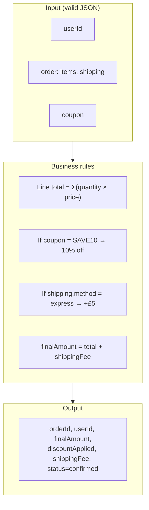

# Martins Test Group 2 — Flow Description & Diagram

## Overview

**Martins Test Group 2** is an HTTP-triggered order processing flow. It accepts JSON orders (POST/PUT/DELETE on port 9999), validates them against a schema, runs pricing/discount/shipping logic, and returns either a confirmation payload or an error response.

---

## Flow Description

### Ingress & validation

1. **HandleHttpRequest** — Listens for HTTP requests (configured listening port, often **80** in the UI; default for the processor type is 80). Accepts POST, PUT, DELETE. Each request becomes one FlowFile.
2. **Log Raw Input** — Logs incoming request (observability).
3. **Validate Input JSON** — Validates body against a JSON Schema:
   - **Required:** `userId` (string), `order` (object).
   - **order:** must have `items` (array of `{ productId, quantity, price }`, min 1 item) and `shipping` (object with required `address`; optional `method`).
   - **Optional:** `coupon` (string).

**If validation fails** (malformed JSON or schema violation):
- FlowFiles go to **Handle Invalid JSON** (warn log with payload).
- Then to **Build Error JSON Response**, which sets body to:  
  `{"error": "Input JSON invalid or missing required fields"}`.
- **HandleHttpResponse** sends this back to the client (HTTP 200).

**If validation succeeds:**
- FlowFiles go to **Extract Fields**.

### Business logic path

4. **Extract Fields** (EvaluateJsonPath) — Puts into FlowFile attributes (for routing and downstream use):
   - `userId` ← `$.userId`
   - `coupon` ← `$.coupon`
   - `shipping_address` ← `$.order.shipping.address`
   - `shipping_method` ← `$.order.shipping.method`

5. **Check Coupon** (RouteOnAttribute) — Routes on `coupon == 'SAVE10'`:
   - **coupon_valid** and **unmatched** both feed into the same downstream processor (Script Order Processing). So every valid request is processed; the script itself applies the discount only when `coupon == 'SAVE10'`.

6. **Script Order Processing (Calc Amount, Discounts, Fee, OrderId)** — Groovy ScriptedTransformRecord. This is the **core business logic**:
   - Reads the incoming record (userId, order with items and shipping).
   - **Line total:** sum over items of `quantity * price`.
   - **Coupon:** if `coupon == 'SAVE10'`, multiply total by 0.9 and set `discountApplied = true`.
   - **Shipping fee:** `shippingFee = 5.0` if `order.shipping.method == 'express'`, else `0.0`. Added to total.
   - **Output record:** `orderId` (new UUID), `userId`, `finalAmount`, `discountApplied`, `shippingFee`, `status: 'confirmed'`.

7. **Create JSON Response** — ReplaceText: replaces entire content with the script output (record serialized as JSON by the Record Writer).
8. **Log Order Response** — Logs the response (observability).
9. **HandleHttpResponse** — Sends the JSON response back to the client (HTTP 200).

---

## High-Level Flow Diagram (Business Logic Focus)

```mermaid
flowchart LR
    subgraph Ingress
        A[HTTP Request\nListening port] --> B[Log Raw Input]
        B --> C{Validate JSON\nSchema}
    end

    subgraph ErrorPath["Error path"]
        C -->|failure / invalid| D[Handle Invalid JSON]
        D --> E[Build Error JSON\n"error": "Input JSON invalid..."]
        E --> R[HTTP Response]
    end

    subgraph BusinessLogic["Business logic"]
        C -->|valid| F[Extract Fields\nuserId, coupon, shipping]
        F --> G[Check Coupon\nSAVE10?]
        G --> H[Order Processing Script]
        H --> I[Create JSON Response]
        I --> J[Log Order Response]
        J --> R
    end

    subgraph ScriptDetail["Order processing script (conceptual)"]
        H1[Line total = Σ qty × price]
        H2[Coupon SAVE10 → total × 0.9]
        H3[Express shipping → +£5 fee]
        H4[Output: orderId, finalAmount,\ndiscountApplied, status]
        H1 --> H2 --> H3 --> H4
    end
```

### Simplified “business only” view



---

## Summary

| Aspect | Detail |
|--------|--------|
| **Trigger** | HTTP POST/PUT/DELETE (listening port as configured in the processor; default is 80) |
| **Input** | JSON: `userId`, `order` (items + shipping), optional `coupon` |
| **Validation** | JSON Schema (draft 2020-12); invalid → fixed error JSON response |
| **Core logic** | Script: line total → optional 10% discount (SAVE10) → optional £5 express fee → confirmed order record |
| **Response** | JSON: `orderId`, `userId`, `finalAmount`, `discountApplied`, `shippingFee`, `status` or `{"error": "..."}` |

Note: The flow currently reports **errors** in NiFi because the HTTP Context Map and Record Reader/Writer controller services are disabled. Enabling those services would allow the flow to run.
